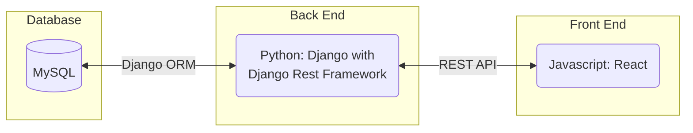
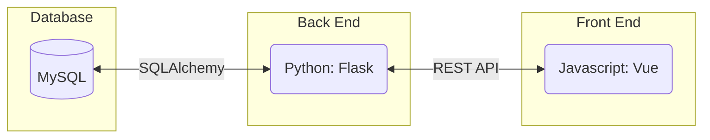
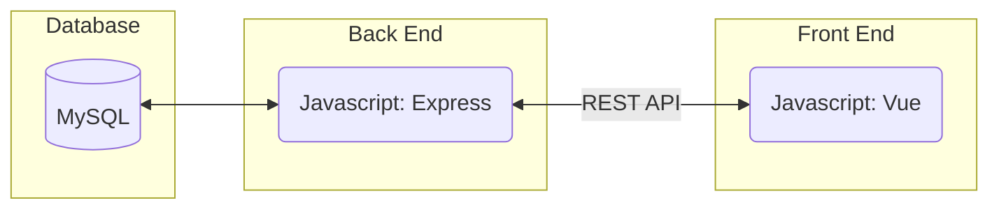
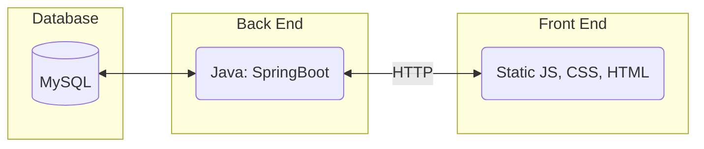
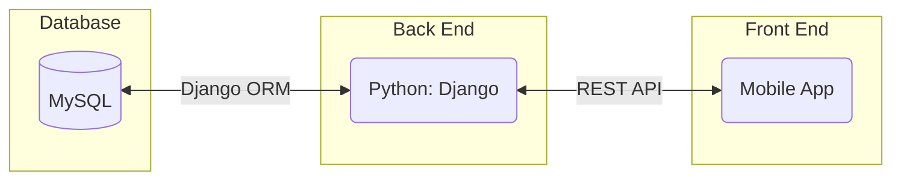
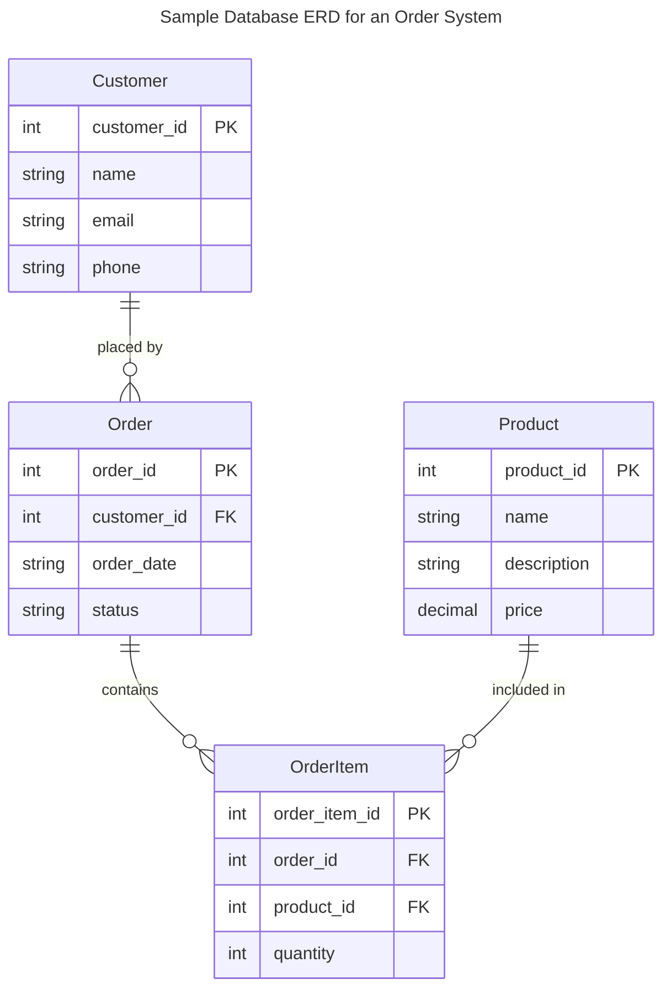
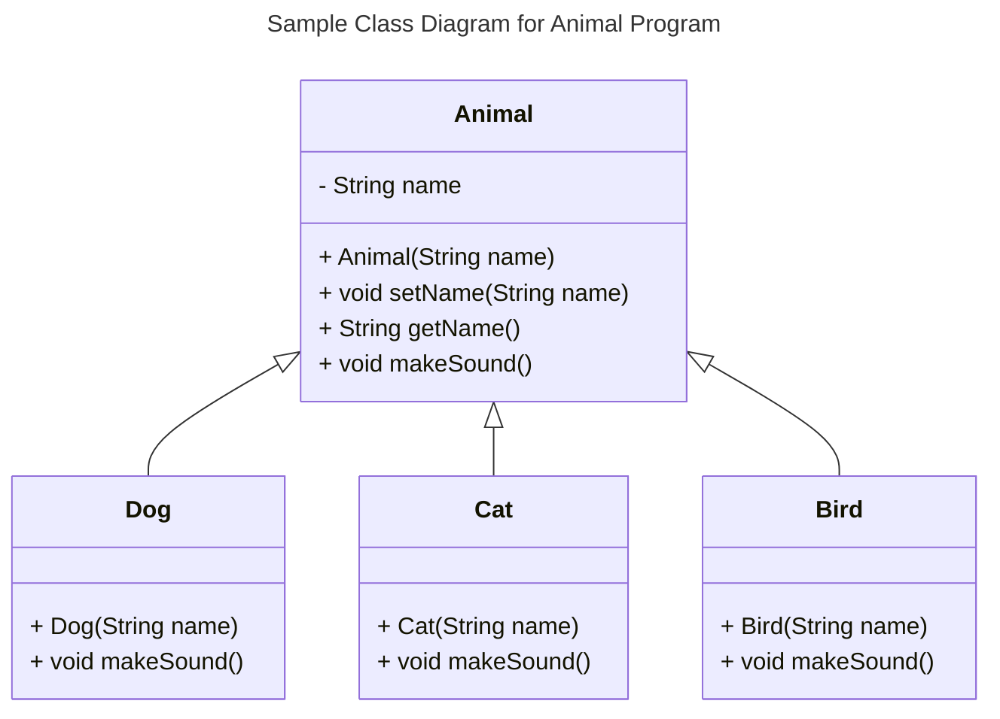
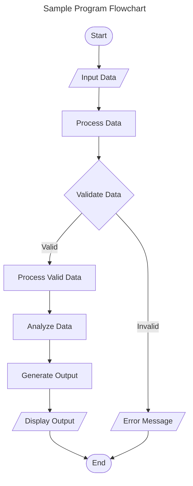
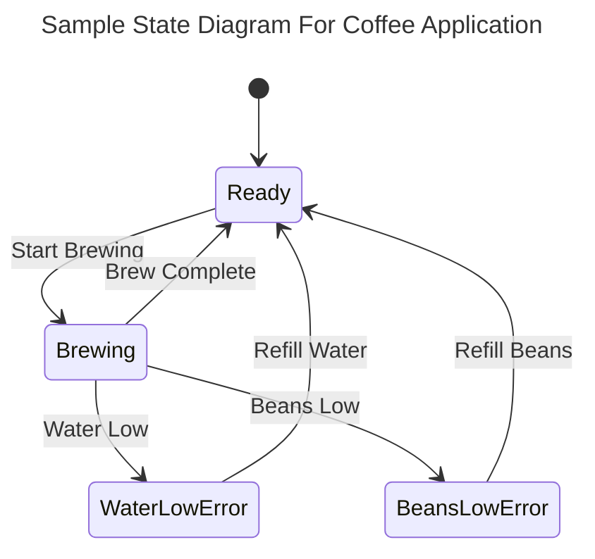
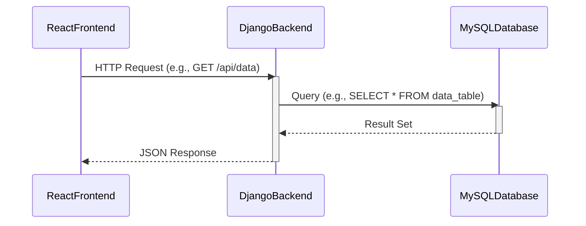

# Specification Document

Please fill out this document to reflect your team's project. This is a living document and will need to be updated regularly. You may also remove any section to its own document (e.g. a separate standards and conventions document), however you must keep the header and provide a link to that other document under the header.

Also, be sure to check out the Wiki for information on how to maintain your team's requirements.

## TeamName

Pluto

### Project Abstract

Ever wished to relive nostalgic memories playing old Atari games, but have stayed reluctant because you wish they had been more expansive and full of the same charm that has made many modern games so enjoyable? By introducting rogue-like game mechanics to enhance the Atari arcade gaming experience into an ever evolving and ceaselessly unique rogue-like game, our project aims to benefit from both old and new eras and take a modern spin on the 1980's arcade hit Asteroids.

<!--A one paragraph summary of what the software will do.-->

<!--This is an example paragraph written in markdown. You can use *italics*, **bold**, and other formatting options. You can also <u>use inline html</u> to format your text. The example sections included in this document are not necessarily all the sections you will want, and it is possible that you won't use all the one's provided. It is your responsibility to create a document that adequately conveys all the information about your project specifications and requirements.-->

### Customer

The customer-base for our game would be those born around generation Z who are enthusiastic for older-style games, but aren't willing to forgo the many creative additions that have made modern games as treasurable as they are today.

<!--A brief description of the customer for this software, both in general (the population who might eventually use such a system) and specifically for this document (the customer(s) who informed this document). Every project will have a customer from the CS506 instructional staff. Requirements should not be derived simply from discussion among team members. Ideally your customer should not only talk to you about requirements but also be excited later in the semester to use the system.-->

### Specification

We'll utilize a database to track statistics of gameplay aspects that will provide insight into things that the game excels at, as well as those that might be holding it back.

<!--A detailed specification of the system. UML, or other diagrams, such as finite automata, or other appropriate specification formalisms, are encouraged over natural language.-->

<!--Include sections, for example, illustrating the database architecture (with, for example, an ERD).-->

<!--Included below are some sample diagrams, including some example tech stack diagrams.-->

#### Technology Stack

Here are some sample technology stacks that you can use for inspiration:

#### Database

#### Class Diagram

#### Flowchart

#### Behavior

#### Sequence Diagram

### Standards & Conventions

<!--This is a link to a seperate coding conventions document / style guide-->
[Style Guide & Conventions](STYLE.md)
